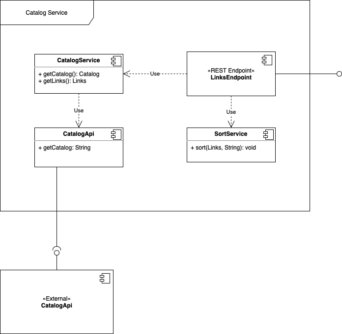
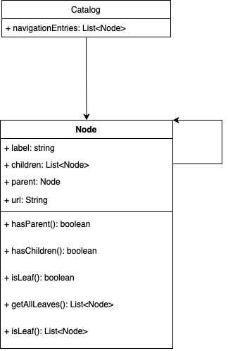

# Catalog Filter Service

### To Run The Service

1. Navigate into folder `catalog-filter` with: `cd ./catalog-filter`

2. Make sure that Docker is running on your machine

3. To get the Catalog-Filter Service up and running:

   - The Fastest - Cool Way :
     - run command: `docker-compose up`

   - The Traditional Way:
     - run `docker build -t catalog-filter:0.0.1-SNAPSHOT .` to build Dockerimage
     - run `docker run -it -p 80:80 catalog-filter:0.0.1-SNAPSHOT` to start Dockercontainer

### About The Development of this service 

As I began with the development of this service, there are 3 main design decisions to be made. 

##### 1. The Components of the Service

​	The Service should consist of 4 main Components. 

- **LinkEndpoint**: is responsible for handling incomming request and delegate the required processing/accessing Data to other components
- **CatalogApi**: represents the data accessing layer and is responsible for taking with the external **catalog-api**
- **CatalogService**: relies on **CatalogApi** for loading data and responsible for manipulating data to provide result back to **LinkEndpoint** restcontroller.
- **SortService**: will manage sort strategies based on the sorting option as input from client. The suitable strategy will be applied to sort the outgoing ResponseEnity

#### 	

Figure 1. Service Architechture

##### 2. The TreeModel of the Catalog 

As I observed the structure of the JsonObjects comming from the **remote-catalog-api**. it was critical to have a dynamic data model for parsing these Objects. Figure 2. show the UML class diagram of the catalog. There are some important bullet points, which considered to be important to the model:

- In order to be able to travers bidirectional within the model, every node has to be aware of their parent node and also their children. 
- Each nodes has to be able to decide whether it is the last of its kind (a leaf)

Figure 2. Catalog Datamodel

##### 3. The sorting Strategy

|          |   LABEL    |    URL     |
| :------- | :--------: | :--------: |
| **ACS**  | label:asc  |  url:asc   |
| **DESC** | label:desc | label:desc |

