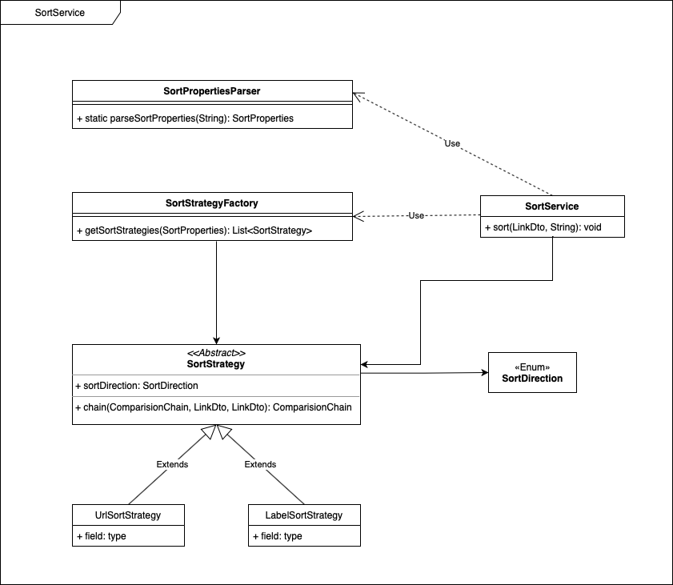

# Catalog Filter Service

### To Run The Service

1. Navigate into folder `catalog-filter` with: `cd ./catalog-filter`

2. Make sure that Docker is running on your machine.

3. To get the Catalog-Filter Service up and running:

   - The fastest - the cool way :
     - run command: `docker-compose up`

   - The traditional way:
     - run `docker build -t catalog-filter:0.0.1-SNAPSHOT .` to build Docker image.
     - run `docker run --env-file ./dev.env -it -p 80:80 catalog-filter:0.0.1-SNAPSHOT` to start Docker container.

4. The Service is now running on port 80. To test it: use following command:
     `curl 'http://localhost/links?parent=Alter'` 

### About The Development of this service 

As I began with the development of this service, there are 3 main design decisions to be made. 

##### 1. The Components of the Service

​	The Service should consist of 4 main Components. 

- `LinkEndpoint`: is responsible for handling incomming request and delegating the requiredment to other components to process.
- `CatalogApi`: represents the data accessing layer and is responsible for talking with the external **catalog-api**.
- `CatalogService`: relies on `CatalogApi` for loading data and is responsible for manipulating data to provide results back to `LinkEndpoint` REST-controller.
- `SortService`: will manage sorting strategies, based on the sorting options as input from client. The suitable strategies will be applied to sort the outgoing responding entities.

#### 	

Figure 1. Service Architechture

##### 2. The TreeModel of the Catalog 

As I observed the structure of the JsonObjects comming from the remote **catalog-api**. It was critical to have a dynamic data model for parsing these Objects. Figure 2. show the UML class diagram of the catalog. There are some important bullet points, which considered to be important to this model:

- In order to be able to traverse bidirectional within the model, every node has to be aware of their parent node and also their children nodes. 
- Every element of the Catalog can be a node. A leaf can be a node itself but without children.
- Each node has to be able to decide whether it is the last of its kind (a leaf).

Figure 2. Catalog Datamodel

##### 3. The sorting Strategy

For the sorting functionality, I decided to use **Strategy Pattern** and **Abstract Factory Pattern** to increase the flexiblity and the ability for future extensions. Each sorting decision ist captured in `SortStrategy` object, which provides the appropriate comparing functions for its own situation. More future sorting strategy can be easily added by expanding `SortStrategy` class and provide a new `SortStrategyFactory` to generate the new strategy.

- For Sorting a list of LinkDtos, `SortService` uses `SortPropertiesParser` to parse `SortProperties` from sortOption string from user, which specifies which field should be sorted and which direction (asc, desc). 
- With `SortProperties` `SortStrategyFactory` will be able to generate sorting strategies (in our case `UrlSortStrategy` and `LabelSortStrategy`) for `SortingService` to apply for the unsorted list.
- Each `SortStrategy` has a `chain()` methodes, which combines the incomming `ComarisonChain` with the appropriate comparing specs for its type of strategy. The order of the sorting strategies will affects how the list is sorted. 

##### 4. The Development Lifecycle

- The **Catalog-Filter Service** was developed in multiple closed iterations. After each iteration a runable service was created with the evolving sets of demanded features, unit tests and integration tests. 
- **TDD** were applied in every iteration. 
- Test coverage was constantly check with both IDE testing and jacoco report, which can be found and reviewed as HTML file in the build folder.  (>92% Codecoverage)

- Code refinement happened not only at the end of the main development lifecycle, but also used frequently during Testing phase.
- After everything was built and localy tested, a Dockerfile was added for building und running the service in Docker environment.  

##### 5. Some thoughts

- As in the Scope of this challenge, the credential is store in a .env file (in this case `dev.env`), which generally should not be exposed and submit to git repository. This is The the real world situation, this files should either be encrypted (with git secret) or the credentials should be store in a Key-Store service, which can only be access while running on server.
- There is a consideration between empty array and code 200 instead of 204 with no body in case of the queried parent can not be found. This would be convinient for JavaScript frontend clients in the way that they do not have to deal with an extra response code. But for this situation the a response with code 204 an no boby would be acceptable.
